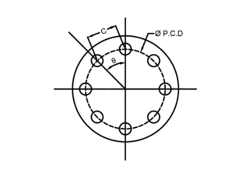

# Flange Hole Marker

Calculate flange hole marking of equi-spaced flange holes, flange holes at any Angle and to calculate maximum No. of holes can be marked on circle.

  

## Terms
### Flange Pitch Circle Diameter (PCD)

`Flange Pitch Circle Diameter (PCD)` is noting but the diameter along bolt hole center. It is denoted by (PCD). This diameter is also called as `Bolt Center Diameter (BCD)`. It is very important parameter while diving flange hole. You can refer for standard reference drawing to understand this dimension to provide correct input values. You can use any dimensional units such as Inches or MM as per your preference. If you are using Inches as units for your input values then please refer decimal fractional chart to enter proper input values.

### No. of Holes (N)

`No. of Hole (N)` is noting but how many holes we want mark on available flange pitch circle diameter or bolt center diameter. It denoted by `N`. It can be any no. of holes as per your flange configuration. You can refer for standard reference drawing to understand this dimension to provide correct input values.

### Hole Angle in Degrees (θ)

Flange hole angle is nothing but angle on which this flange hole to be going to mark. It denoted by `θ`. This angle should be enter in to `degrees`. This angle is depends upon location of you hole on pitch circle diameter or bolt circle diameter with respective to your selected plane.You can refer for standard reference drawing to understand this dimension to provide correct input values.

### Circle Diameter (D)

`Circle Diameter (D)` is used only while calculating maximum no. of equivalent hole can be fitted inside circle at equal distance or equal pitch. Circle diameter is referred in this calculator as `Outer Diameter of Circle` on which we want to calculate maximum no. of small diameter holes can be available to mark. You can refer for standard reference drawing to understand this dimension to provide correct input values. You can use any dimensional units such as Inches or MM as per your preference. If you are using Inches as units for your input values then please refer decimal fractional chart to enter proper input values.

### Hole Diameter (d)

`Hole Diameter (d)` is nothing but the diameter of Hole that going to mark inside outer circle while calculating equivalent no. of holes. It is denoted by `d`. You can refer for standard reference drawing to understand this dimension to provide correct input values. You can use any dimensional units such as Inches or MM as per your preference. If you are using Inches as units for your input values then please refer decimal fractional chart to enter proper input values.

### Hole Marking Distance (C)

`Hole Marking Distance (C)` is calculated by this calculator using your input values. Hole Marking Distance is required to `Mark hole on Pitch circle diameter or Bolt circle diameter`. It very useful dimension to locate hole on flange. this values can be calculated according to your input units selection.

## Inspired by
https://letsfab.in/online-calculators/flange-hole-marking-calculator/